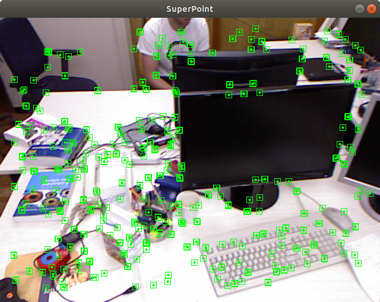
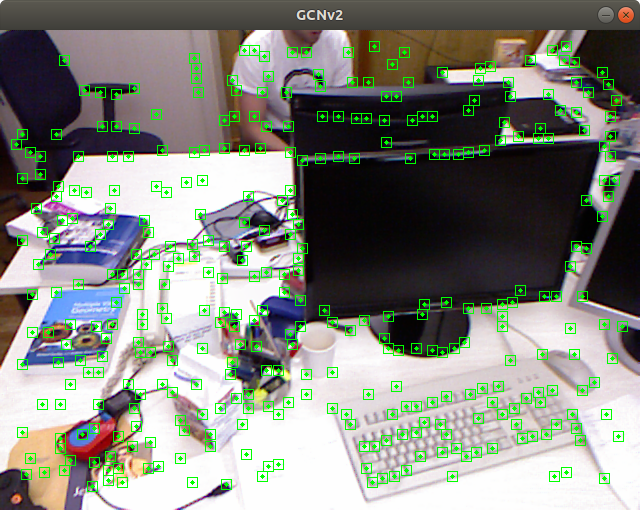

# Semantic Feature Points

* SuperPoint
* GCNv2 features

---

# Prerequisites

* OpenCV 3

* LibTorch
  - SuperPoint: LibTorch 1.2.0 `wget https://download.pytorch.org/libtorch/cpu/libtorch-cxx11-abi-shared-with-deps-1.2.0.zip`

  - GCNv2: LibTorch 1.10.0+cu102 (the latest)

# Build

```sh
cmake -B build [-D BUILD_SP=0 -D BUILD_GCN=1] # select one
cmake --build build -j4
```

# Run

```sh
./build/super_point
# or
./build/gcn_ftr
```

<p align="center">
  
  
</p>

# Algorithms

## SuperPoint

Ref

* [magicleap/SuperPointPretrainedNetwork](https://github.com/magicleap/SuperPointPretrainedNetwork): SuperPoint Weights File and Demo Script

* [SuperPoint-SLAM](https://github.com/KinglittleQ/SuperPoint_SLAM)

* [open_vins_with_superpoint](https://github.com/robintzeng/open_vins_with_superpoint/tree/Superpoint)

## GCNv2 Feature

Ref

* [GCNv2 SLAM](https://github.com/jiexiong2016/GCNv2_SLAM)
* [Pytorch1.4下运行 GCNv2slam 需要修改的地方](https://blog.csdn.net/weixin_45650404/article/details/106085719)

